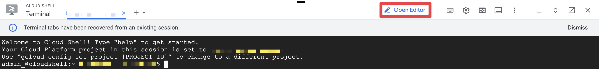

# Google GenAI4SAP Application
<walkthrough-tutorial-duration duration="10min"></walkthrough-tutorial-duration>

## Deployment Setup

This tutorial will guide you through GenAI4SAP deployment.

Click the **Start** button to move to the next step.

## Please select a project for deployment or create one.

This project will be used:
-   As the source project for Cortex Data Foundation.
-   To execute the deployment steps.

<walkthrough-project-setup billing="true"></walkthrough-project-setup>

### **Filling config.ini file**

Let's fill the config.ini file to run the setup.

Click on button 'Open Editor' in cloud shell.



Fill the config.ini file with your data:


Simply run this command in Cloud Shell:

```bash
./setup.sh 
```

<walkthrough-project-setup billing="true"></walkthrough-project-setup>

### **Filling config.ini file**

We can automatically deploy appllication and artifacts for you in a few clicks.

Simply run this command in Cloud Shell:

```bash
./setup.sh 
```

*__Looking to learn how deployment works?__*

*Follow [deployment instructions in README](https://github.com/GoogleCloudPlatform/cortex-data-foundation/blob/main/README.md)*

<walkthrough-footnote>The 1-Click deployment would create all datasets and GCS buckets. </walkthrough-footnote>

## Conclusion

Thanks for using Google Cloud Cortex Framework!

<walkthrough-conclusion-trophy></walkthrough-conclusion-trophy>
